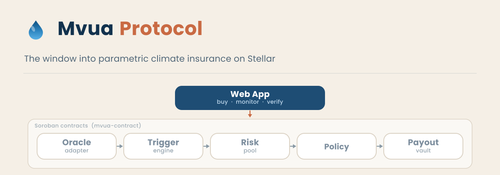

<p align="center">
  
</p>

<h1 align="center">Mvua Protocol Web</h1>

<p align="center">
  <a href="./.github/workflows/ci.yml"></a>
  <a href="./LICENSE"></a>
  
  
</p>

<p align="center">
  <b>The web layer of <a href="https://github.com/Mvua-Protocol/mvua-contract">Mvua Protocol</a>: parametric climate insurance on Stellar.</b>
</p>

Mvua lets smallholder farmers and climate exposed communities buy micro insurance policies in USDC and get paid automatically when on chain weather data shows a failed season. This app is the window into that protocol: pool dashboards, policy purchase, and a payout explorer, served by Next.js and deployed on Vercel.

> Status: **pre alpha**, in active development. The app targets the Stellar testnet against contracts under active development.

<!-- PLACEHOLDER_BODY -->

## This repository in the whole project

Mvua Protocol is built as separate repositories under the [Mvua-Protocol](https://github.com/Mvua-Protocol) organization. **This repository is the interface**: the app people actually touch. It holds no funds and decides no outcomes. It reads protocol state, presents it clearly, and helps users submit signed transactions to the contracts.

| Layer | Repository | What it does |
|---|---|---|
| **Interface** | **`mvua-app`** (this repo) | **Pool dashboards, policy purchase, payout explorer.** |
| On chain core | [`mvua-contract`](https://github.com/Mvua-Protocol/mvua-contract) | Risk pools, policies, oracle adapter, trigger engine, payout vault. |

The banner above shows the picture: this app is the window highlighted at the top, and the Soroban contracts beneath it are the machine that holds funds and decides payouts. Keeping that boundary strict is a design rule, not an accident.

## Planned surfaces

| Surface | What it does | Status |
|---|---|---|
| Pool dashboard | TVL, tranche split, premiums, payouts, solvency ratio | planned |
| Policy purchase | Pick region and coverage, pay premium, receive policy certificate | planned |
| Payout explorer | Trigger status per region, payout batches, ledger links | planned |
| Publisher console | Oracle publisher status and fee ledger (read only) | planned |
| Cooperative mode | Batch purchase for farmer groups | planned |
| USSD gateway | Phone first access for feature phones (separate gateway service) | planned |

Interface implementation begins later in the program roadmap, once the core contract lifecycle is wired end to end on testnet. This repository currently ships governance, CI, and pinned configuration so the app can be built on a stable base.

## Getting started

Prerequisites: Node.js 24 (see `.nvmrc`), npm 11 or newer, and a [Freighter](https://www.freighter.app/) wallet for testnet interaction.

```bash
git clone https://github.com/Mvua-Protocol/mvua-app
cd mvua-app
nvm use
npm install
cp .env.example .env.local
npm run dev
```

Open [http://localhost:3000](http://localhost:3000).

## Scripts

| Command | What it does |
|---|---|
| `npm run dev` | Start the development server |
| `npm run build` | Production build |
| `npm run lint` | ESLint |
| `npm run typecheck` | TypeScript project check |
| `npm run test` | Unit tests (vitest) |
| `npm run e2e` | Playwright end to end suite (later in the roadmap) |

## Environment variables

Copy `.env.example` to `.env.local`. Client visible variables are prefixed `NEXT_PUBLIC_` and never contain secrets.

| Variable | Purpose |
|---|---|
| `NEXT_PUBLIC_STELLAR_NETWORK` | `testnet` until mainnet launch |
| `NEXT_PUBLIC_HORIZON_URL` | Horizon endpoint for the active network |
| `NEXT_PUBLIC_SOROBAN_RPC_URL` | Soroban RPC endpoint for the active network |
| `NEXT_PUBLIC_CONTRACT_RISK_POOL` | Deployed risk pool contract ID |
| `INDEXER_API_URL` | Server side indexer endpoint (no secrets here either) |

## Deployment

The app deploys on [Vercel](https://vercel.com):

- **Preview** environment for every pull request.
- **Production** environment tracking `main`, pointed at Stellar testnet until mainnet launch.

Environment variables are managed in the Vercel project settings and mirrored in `.env.example`. Detailed runbook: [`docs/VERCEL.md`](./docs/VERCEL.md).

## Architecture notes

- Contract interaction is isolated in a typed client layer; UI components never call chain SDKs directly. The app reads and submits, the contracts decide.
- The indexer is a lightweight event reader backed by the public read API; the app stays stateless beyond caching.
- Accessibility (WCAG 2.1 AA target) and low bandwidth friendliness are requirements, not afterthoughts. Much of our audience is on slow connections and modest devices.

## Contributing

Read [`CONTRIBUTING.md`](./CONTRIBUTING.md) for the workflow and conventions: conventional commit titles, exact dependency pins, green lint and type checks, and no em dashes anywhere. Good first issues are labeled `good first issue`.

## Security

See [`SECURITY.md`](./SECURITY.md). Report privately and never open public issues for vulnerabilities.

## License

[MIT](./LICENSE) (c) the Mvua Protocol contributors.
